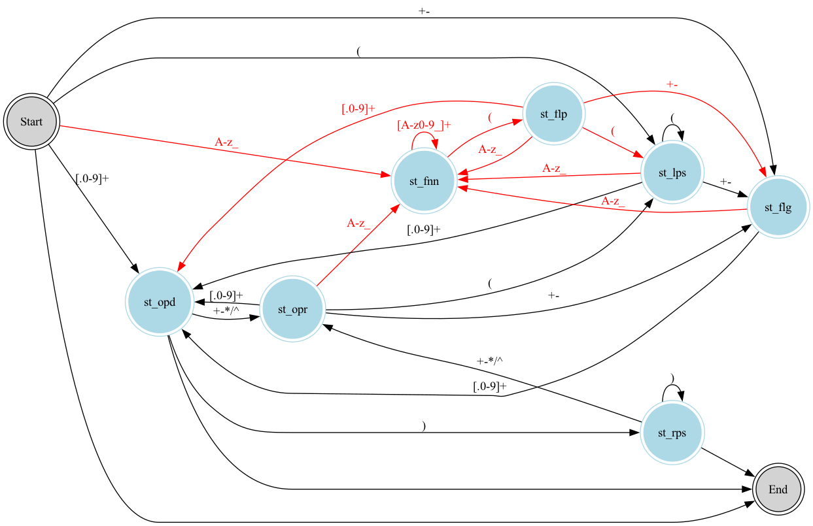

# calc

```
st_ops stands for state operator, can be '+', '-', '*', '/', '^'
st_opd stands for state operand, can be 0-9 and '.'
st_lps stands for left parenthesis: '('
st_rps stands for right parentesis: ')'
st_flg stands for flags: '+' or '-'
st_fnn stands for function name: int, floor, ceil, round, fabs, sqrt
st_flp stands for function left parenthesis: fnn'('
```



## Usage

```bash
$ ./calc 'fabs((-5 + (-00.01 - 0.09) * 10 ^ 2) / 5)'
3
```
